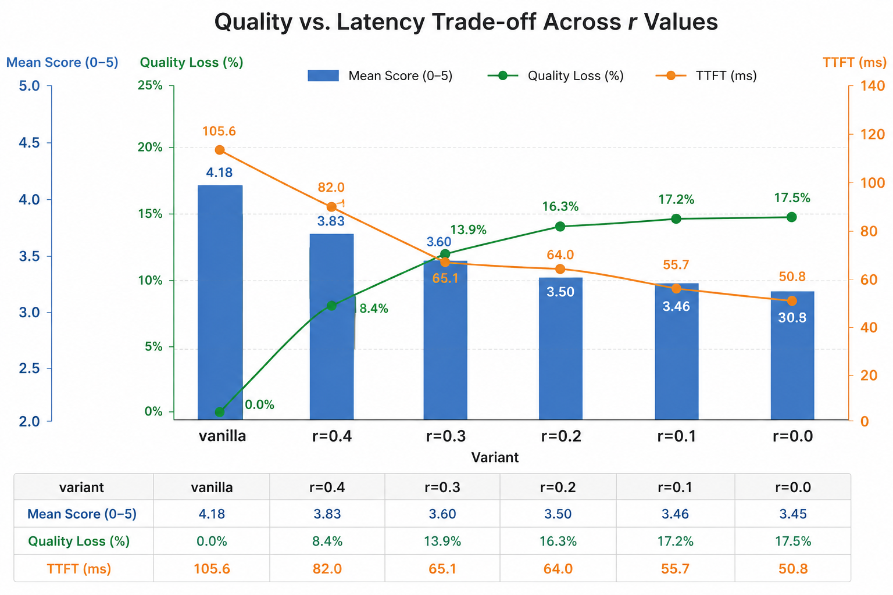

# Personal-Context KV Reuse for RAG (vLLM)

Cross-request **KV-cache reuse for retrieval-augmented generation** on top of
vLLM v1.

In a RAG serving loop the same retrieved chunks (your calendar, your messages,
a knowledge-base passage) are fed back into the model on *every* request, and
vLLM re-prefills them from scratch every time. Prefill is the expensive part of
a RAG turn — it dominates **time-to-first-token (TTFT)**. This project encodes
each chunk's key/value tensors **once, offline**, stores them in a
content-addressed KV store, and **scatters them straight into vLLM's paged KV
cache** at query time so the model never recomputes them.

The result is a drop-in `KVConnectorBase_V1` implementation
(`PersonalContextKVConnector`) plus a small, fully-tested support library
(`vllm.v1.personal_context`) and a set of runnable demos, benchmarks, and
numerical-correctness diagnostics under this directory.

> ⚠️ **Research / experimental feature.** This is a fork of vLLM. It targets
> standard-RoPE decoder models (Qwen2.5, Llama-3) and is meant for
> experimentation and benchmarking, not production serving.

---

## Table of contents

- [Why this exists](#why-this-exists)
- [How it works](#how-it-works)
- [Repository layout](#repository-layout)
- [Installation](#installation)
- [Quickstart](#quickstart)
- [Usage reference](#usage-reference)
- [Technical deep dive](#technical-deep-dive)
- [Configuration reference](#configuration-reference)
- [Supported models](#supported-models)
- [Benchmarking](#benchmarking)
- [Correctness diagnostics](#correctness-diagnostics)
- [Testing](#testing)
- [Limitations & sharp edges](#limitations--sharp-edges)

---

## Why this exists

A RAG request looks like:

```
prompt = system_prompt  +  chunk_1 + chunk_2 + … + chunk_k  +  user_query
```

The retrieved chunks are usually the bulk of the tokens, and they recur across
requests. Vanilla vLLM recomputes attention over all of them on every prefill.
If a chunk's KV were already in the cache, prefill would only have to pay for
`system + query + (optionally) a fraction of the chunks`, cutting TTFT roughly
in proportion to how many chunk tokens are reused.

vLLM's built-in **prefix caching** can't help here: it is *position-dependent*
and *prefix-contiguous* — it only reuses a block if the entire token prefix up
to that block is byte-identical. Retrieved chunks appear at different offsets,
in different orders, interleaved with different system prompts, so the prefix
almost never matches. We need a **position-independent, content-addressed** KV
cache that can place a chunk anywhere in a new prompt. That requires solving the
one thing that makes KV position-dependent: **RoPE**.

---

## How it works

### Offline ingestion (once per chunk)

```
chunk text
  │  tokenize, pad to a block_size multiple
  ▼
HFChunkEncoder  ── runs the target model on the chunk in isolation
  │              harvests past_key_values, slices per block,
  │              permutes to NHD layout
  ▼
per-block (content_hash → KVBlock)   ──►  KV store (Redis)
                                          + vector  ──► vector DB
```

Each chunk is hashed **per block** with a position-independent SHA-256 over its
token ids (+ optional tenant salt), domain-separated from vLLM's own
prefix-rolling hashes. K is stored *post-RoPE at its encoding position*; V is
position-independent.

### Online query (per request)

```
user query
  │ embed → vector DB top-k → retrieved chunks
  ▼
build prompt = sys + chunks + query   and   a reuse_plan describing the chunks
  ▼
vLLM.generate(prompt, kv_transfer_params={"reuse_plan": …})
  │
  ├─ scheduler: get_num_new_matched_tokens()   discount prefill budget by reused tokens
  │             build_connector_meta() → Selector.select()
  │               → pick selected_positions to recompute (sparse-Q)
  │
  └─ worker:    start_load_kv()
                  load_plan()             fetch blocks, apply DELTA-RoPE to K
                  scatter_loaded_plan()   copy_() K/V into the paged cache blocks
                build_sparse_q_arrays()   expand query → (query ∪ selected_positions)
                chunk-aware prefill       forward only those positions
```

The two non-obvious pieces are **delta-RoPE** (re-rotating a chunk's stored K
from its encoding position to wherever it lands in the new prompt) and
**sparse-Q selective recompute** (recomputes only a
fraction `r` of each chunk to trade quality against prefill cost). Both are
covered in the [deep dive](#technical-deep-dive).

---

## Repository layout

| Path | What it is |
| --- | --- |
| `vllm/v1/personal_context/` | The support library: hashing, storage, delta-RoPE, load, scatter, selection, chunk-aware prefill, cache-isolation policy. ~1.3k LoC, fully unit-tested. |
| `vllm/distributed/kv_transfer/kv_connector/v1/personal_context_connector.py` | `PersonalContextKVConnector` — the vLLM-facing `KVConnectorBase_V1` glue (~1.1k LoC). Registered in the connector `factory.py`. |
| `examples/personal_context/rag_demo.py` | End-to-end RAG demo: ingest a JSONL corpus, retrieve from a vector DB, generate with KV reuse. |
| `examples/personal_context/chunk_encoder_hf.py` | Offline chunk→KVBlock encoder backed by HuggingFace transformers; model presets. |
| `examples/personal_context/bench_prefill.py` | TTFT + generation-quality benchmark sweeping the selective-recompute knob `r`. |
| `examples/personal_context/diff_encoder_vs_vanilla_k.py` | Numerical diagnostic: encoder K vs vanilla HF K vs vanilla vLLM K, layer by layer. |
| `examples/personal_context/diff_sparse_q_r.py` | Numerical diagnostic: K written by sparse-Q at `r=0.9` vs the `r=1.0` baseline. |
| `examples/personal_context/sample_data.jsonl` | 5 personal-context RAG instances (calendar/messages/notes/email/contacts) with gold answers. |
| `tests/v1/personal_context/` | Unit + integration + CPU/GPU e2e tests (15 files). |

---

## Installation

This repo follows the vLLM contributor workflow — use `uv`, never bare `pip`.

```bash
# Build vLLM (Python-only changes, precompiled kernels):
uv venv --python 3.12
source .venv/bin/activate
VLLM_USE_PRECOMPILED=1 uv pip install -e . --torch-backend=auto

# Add the personal-context extras (vector DB, embeddings, Redis, scoring):
uv pip install -e ".[personal-context]"
```

The `personal-context` extra pulls in:

| Package | Scope | Used for |
| --- | --- | --- |
| `faiss-cpu>=1.8.0` | Demo | Vector DB for the example's retrieval index |
| `sentence-transformers>=3.0.0` | Demo | Query/chunk embeddings for retrieval |
| `redis>=5.0.0` | Store backend | Optional cross-process KV store (`store_backend=redis`) |
| `fakeredis>=2.20.0` | Tests | In-process Redis for unit tests |
| `rouge-score>=0.1.2` | Benchmark | ROUGE-L quality scoring |

None of these are required by the core connector or the
`vllm.v1.personal_context` library itself — with the default in-memory store it
imports nothing beyond vLLM/torch. They exist only to run the **demo**
(`faiss-cpu` + `sentence-transformers` drive retrieval), the optional Redis store
backend, and the tests/benchmark.

A CUDA GPU is required to run the demos/benchmarks (they boot a real vLLM
engine). The pure-library unit tests run on CPU.

---

## Quickstart

```bash
# In-memory KV store (single process), Qwen2.5-1.5B:
.venv/bin/python examples/personal_context/rag_demo.py \
    --model Qwen/Qwen2.5-1.5B-Instruct \
    --top_k 4 \
    --selector_r 0.8
```

The demo ingests `sample_data.jsonl`, builds a vector DB index, reports retrieval
quality against the labelled gold chunks, then runs the augmented prompt through
vLLM with KV reuse and prints the generated answer next to the gold answer.

### With a Redis-backed store (cross-process)

```bash
docker run -d --name pc-redis -p 6379:6379 redis:7

.venv/bin/python examples/personal_context/rag_demo.py \
    --model meta-llama/Meta-Llama-3-8B-Instruct \
    --store_backend redis \
    --store_url redis://localhost:6379
```

In Redis mode the encoded blocks live in Redis and the vLLM worker pulls them in
via `kv_connector_extra_config` — the same path a real deployment would use,
where ingestion and serving are separate processes.

---

## Usage reference

### `rag_demo.py`

| Flag | Default | Description |
| --- | --- | --- |
| `--data` | `sample_data.jsonl` | JSONL corpus (`id`, `sys`, `query`, `answer`, `chunks`). |
| `--model` | `meta-llama/Meta-Llama-3-8B-Instruct` | HF model id; must have a registered preset. |
| `--top_k` | `4` | Vector DB retrieval depth (top-k). |
| `--selector_r` | `1.0` | Fraction of each chunk to recompute (sparse-Q). `1.0` = full recompute (lossless), `0.0` = pure reuse. |
| `--max_tokens` | `128` | Tokens generated per query. |
| `--embedder` | `sentence-transformers/all-MiniLM-L6-v2` | Retrieval embedding model. |
| `--store_backend` | `memory` | `memory` or `redis`. |
| `--store_url` | `redis://localhost:6379` | Redis URL (redis backend only). |
| `--gpu_memory_utilization` | `0.85` | vLLM VRAM fraction. |

### Programmatic API

KV reuse is driven entirely through vLLM's existing connector + sampling APIs —
no engine surgery:

```python
from vllm import LLM, SamplingParams
from vllm.config import KVTransferConfig
from vllm.inputs import TokensPrompt

# 1) Turn on the connector and pick a selective-recompute policy.
kv_transfer_config = KVTransferConfig(
    kv_connector="PersonalContextKVConnector",
    kv_role="kv_both",
    kv_connector_extra_config={
        "selector": {"type": "SelectFirstR", "r": 0.8},
        # Optional cross-process store:
        "store_backend": "redis",
        "store_url": "redis://localhost:6379",
    },
)

llm = LLM(
    model="meta-llama/Meta-Llama-3-8B-Instruct",
    dtype="float16",
    block_size=16,
    kv_transfer_config=kv_transfer_config,
)

# 2) Per request, attach a reuse_plan describing the retrieved chunks.
reuse_plan = {
    "chunks": [
        {
            "token_ids": chunk_token_ids,  # the chunk's tokens, block-aligned
            "old_pos_start": 0,            # position the chunk was encoded at
            "salt_hex": "",               # optional tenant/namespace salt
        },
    ]
}
sp = SamplingParams(
    max_tokens=128,
    temperature=0.0,
    extra_args={"kv_transfer_params": {"reuse_plan": reuse_plan}},
)

llm.generate([TokensPrompt(prompt_token_ids=prompt_ids)], sampling_params=[sp])
```

The connector reads the `reuse_plan`, looks up each chunk's blocks in the bound
store, and (on a hit) loads + scatters them into the freshly allocated paged
cache blocks before the forward pass.

---

## Technical deep dive

### 1. Position-independent, content-addressed KV blocks

vLLM's prefix cache keys a block on *the entire token prefix leading up to it*,
which is why it can't reuse a chunk that appears at a different offset. The
personal-context store instead hashes **only the block's own token ids** (plus
an optional salt), via `hash_block()` — a 32-byte SHA-256 digest,
domain-separated from vLLM's rolling hashes. The same chunk therefore has the
same key no matter where it lands in a prompt. Blocks are `block_size`-aligned
(default 16 tokens); chunks are **padded**, not truncated,
so content is preserved.

### 2. Delta-RoPE: the key trick

RoPE rotates each key vector by an angle proportional to its absolute position.
A chunk encoded at position `old_pos_start` has K already rotated for *that*
position. Reused at runtime position `new_pos_start`, those rotations are wrong.

Because RoPE rotations compose additively, we don't need the un-rotated K — we
just apply the **difference**:

```
R(old_pos) · R(delta) = R(old_pos + delta) = R(new_pos),   delta = new_pos − old_pos
```

`apply_delta_rope(keys, delta, rope_theta)` rotates a whole block by one constant
`delta` along the position axis (one rotation per layer per block, fp32 internal,
Llama-style rotate-half). V is position-independent and merely cloned.

```python
def apply_delta_rope(keys: torch.Tensor,        # [block_size, num_kv_heads, head_dim]
                     delta: int,
                     rope_theta: float = 10000.0) -> torch.Tensor: ...
```

### 3. Sparse-Q selective recompute

Reusing a chunk's K verbatim is only approximate: a chunk encoded in isolation
never "saw" the surrounding system prompt, so its higher-layer K drifts from
what a full prefill would produce. [CacheBlend's](https://arxiv.org/abs/2405.16444)
insight is that recomputing a *small fraction* of positions recovers most of the
quality. The **selector** decides which positions to recompute:

- `NoSelection` / `r = 0.0` — pure reuse, recompute nothing (cheapest, most drift).
- `SelectFirstR(r)` — recompute the first `ceil(r · L)` positions of each chunk
  (early tokens anchor attention; the prefix recovers most accuracy).
- `r = 1.0` — recompute everything: **provably byte-identical to vanilla vLLM**
  , at no prefill savings.

`SelectFirstR` is the only selector implemented today (it always recomputes a
contiguous prefix). A future selector, **HKVD** (High KV Deviation), is planned:
rather than the prefix, it picks the positions whose stored KV deviates most from
a full prefill.

At `r < 1` the recomputed Q rows are **non-contiguous**, so the connector forces
the **FlashInfer** backend and builds a custom causal mask
(`build_pc_prefill_custom_mask`) — otherwise FlashAttention treats the Q row
index as the absolute position and the causal mask drifts wherever sparse-Q
skips a position.

### 4. Cache-isolation invariant

A mixed-KV request (one carrying a `reuse_plan`) must **never** write its blocks
back into vLLM's position-dependent prefix cache: a later request sharing that
prefix would then read K rotated for the wrong position.

### 5. Connector lifecycle

`PersonalContextKVConnector` implements the `KVConnectorBase_V1` contract:

| Step | Method | Role |
| --- | --- | --- |
| Scheduler | `get_num_new_matched_tokens` | Trust the retriever (chunks came from this store), so report the full reused token count and discount the prefill budget. Lookup runs defensively — any miss falls back to full prefill. |
| Scheduler | `update_state_after_alloc` | Stash `(plan, num_external_tokens)` once blocks are allocated. |
| Scheduler | `build_connector_meta` → `_invoke_selector` → `Selector.select` | Pair each plan with its scheduler-assigned block ids, and pick `selected_positions` to recompute (sparse-Q). |
| Worker | `start_load_kv` | `load_plan()` (fetch + delta-RoPE) then `scatter_loaded_plan()` into the paged cache. |
| Worker (runner) | `_pc_build_sparse_q_arrays` | Expand the forwarded Q rows to `query ∪ selected_positions`; FlashInfer's `_build_pc_custom_mask` masks the non-contiguous Q. |

---

## Configuration reference

All knobs live in `KVTransferConfig.kv_connector_extra_config`.

### Selector

| `selector` value | Behaviour |
| --- | --- |
| omitted / `null` | Default: no recompute, stale K reused as-is. |
| `"NoSelection"` | Same as null. |
| `"SelectFirstR"` | `SelectFirstR(r=1.0)` — full recompute (lossless, no savings). |
| `{"type": "SelectFirstR", "r": 0.5}` | Recompute the first 50% of each chunk. |

> **`SelectFirstR` is currently the only implemented selective-recompute
> policy.** It recomputes a contiguous prefix of each chunk. A second policy,
> **HKVD** (High KV Deviation), is planned — instead of always taking the
> prefix, it will recompute the positions whose stored KV deviates most from a
> full prefill.

### Store backend

| key | values |
| --- | --- |
| `store_backend` | `"redis"` to bind a `RedisKVStorage` (schema auto-verified on connect). Omit for the in-process path. |
| `store_url` | e.g. `redis://localhost:6379` (required when `store_backend="redis"`). |

> For tests and the in-memory demo path, a populated `InMemoryStorage` is
> pickled to the worker via the `VLLM_PERSONAL_CONTEXT_TEST_BIND` env var. This is
> a test/dev channel, not a production mechanism — use Redis for cross-process.

---

## Supported models

Encoding and reuse require the model's exact architecture constants. Registered
presets (`chunk_encoder_hf.KNOWN_PRESETS`):

| Model | Layers | KV heads | head_dim | rope_theta |
| --- | --- | --- | --- | --- |
| `Qwen/Qwen2.5-0.5B-Instruct` | 24 | 2 | 64 | 1,000,000 |
| `Qwen/Qwen2.5-1.5B-Instruct` | 28 | 2 | 128 | 1,000,000 |
| `meta-llama/Meta-Llama-3-8B-Instruct` | 32 | 8 | 128 | 500,000 |

Add a model by declaring a `ModelPreset` and appending it to `KNOWN_PRESETS`.

> **Llama-3.1 / 3.2 are intentionally excluded.** They use `rope_scaling` (NTK)
> piecewise-rescaled frequencies, which `apply_delta_rope` does not implement.
> The encoder refuses scaled-RoPE models loudly rather than corrupting K.

---

## Benchmarking

`bench_prefill.py` sweeps the recompute knob `r` and reports TTFT and generation
quality.

```bash
.venv/bin/python examples/personal_context/bench_prefill.py \
    --model meta-llama/Meta-Llama-3-8B-Instruct \
    --r_values 1.0,0.75,0.5,0.25,0.0
```

**Methodology.** For each `(r, query)` it makes one `generate` call over the
production `sys + chunks + query` prompt with `max_tokens=128`. TTFT is read from vLLM's request metrics.

Quality is measured on the generated text with an LLM-as-judge factual score.
The judge compares each candidate answer against the query's gold answer and
assigns an integer score from `0` to `5`, where `5` means fully factually
correct.

### LLM-as-judge result: Llama-3-8B + oracle retrieval

The following run evaluates `bench_prefill.py` generations with an LLM factual
judge:

```bash
.venv/bin/python examples/personal_context/bench_prefill.py \
    --model meta-llama/Meta-Llama-3-8B-Instruct \
    --data examples/personal_context/sample_data.jsonl \
    --top_k 8 \
    --oracle_retrieval \
    --r_values 0.4,0.3,0.2,0.1,0.0
```

- **Dataset:** [`examples/personal_context/sample_data.jsonl`](examples/personal_context/sample_data.jsonl)
- **Retrieval:** oracle retrieval, `top_k=8`
- **Judge:** GPT-5.5 Thinking, prompted as a strict factual judge
- **Score:** integer `0-5`, where `5` is fully factually correct
- **Quality loss:** relative drop from the vanilla mean judge score



| variant | mean score (0-5) | quality loss | TTFT (ms) |
| --- | ---: | ---: | ---: |
| vanilla | 4.18 | 0.0% | 105.6 |
| `r=0.4` | 3.83 | 8.4% | 82.0 |
| `r=0.3` | 3.60 | 13.9% | 65.1 |
| `r=0.2` | 3.50 | 16.3% | 64.0 |
| `r=0.1` | 3.46 | 17.2% | 55.7 |
| `r=0.0` | 3.45 | 17.5% | 50.8 |

In this run, pure reuse (`r=0.0`) reduced TTFT from `105.6 ms` to `50.8 ms`
while lowering the mean factual-judge score from `4.18` to `3.45`. Intermediate
`r` values expose the expected latency / quality trade-off: higher recompute
fractions recover more quality, while lower recompute fractions reduce TTFT.

<details>
<summary>LLM-as-judge prompt</summary>

```text
You are a strict, impartial FACTUAL JUDGE for a personal-assistant Q&A system.

INPUT FORMAT
I will paste one or more blocks in this format:
[instance_XXX]
Query: <the user's question>
Gold: <the verified ground-truth answer>
<variant> (rougeL=.., cos=..)
<candidate answer>
...more variants...

Each block has ONE Query, ONE Gold, and several CANDIDATE answers labelled "vanilla"
and "r=<number>" (e.g. r=1.0, r=0.5, r=0.0) — different system answers to the SAME
query. Judge EACH candidate independently against that block's Gold and Query.
IGNORE the (rougeL=.., cos=..) numbers — they are not ground truth.

RULES
1. Gold is the ONLY source of truth. Judge factual correctness of what the Query asks
   for — not grammar, style, tone, or length.
2. A candidate fact that CONTRADICTS Gold — wrong date, time, amount, name, place,
   quantity, or a flipped yes/no — is a factual error (a "contradiction") and the most
   serious problem.
3. Treat formatting/paraphrase as EQUIVALENT, never errors: "$1,840"="$1840",
   "May 16"="May 16th"="16 May", "9:30 AM"="9:30am", "Apr"="April", and any rewording
   that preserves meaning. An approximation consistent with Gold ("about $1.8k" for
   $1,840) is NOT a contradiction.
4. Do NOT reward verbosity. A short answer that correctly states what the Query asks
   for is fully correct. Count info as MISSING only if the Query asks for it and Gold
   provides it.
5. Extra details not in Gold: ignore if plausibly consistent; treat as an error only if
   they contradict Gold or are clearly fabricated specifics (invented confirmation
   number, made-up price, etc.).
6. If a candidate is empty, refuses, is off-topic, or echoes the prompt/instructions
   instead of answering, score 0 (this overrides everything below).

KEY DEFINITIONS
- CORE = the single headline fact the Query most centrally asks for (the yes/no, the
  bottom-line number, the name/date asked).
- QUERY-RELEVANT DETAIL = anything the Query also asks for AND Gold provides, beyond CORE.
- ACTIONABLE value = a query-relevant number/date/name the user would act on (a payment
  amount, an appointment time, a person to contact).
- CONTRADICTION = a stated fact conflicting with Gold (rule 2). OMISSION = a
  query-relevant detail simply absent or left vague, with nothing stated that conflicts
  with Gold. A contradiction is ALWAYS worse than an omission of the same scope.

SCORE (integer 0–5) — apply this decision procedure IN ORDER:
First check rule 6 → if it applies, score 0.
Else identify the CORE and ask: is the CORE correct (paraphrase-equivalent to Gold)?

A) CORE correct → score 2–5:
   5 = No contradiction anywhere AND no query-relevant detail missing.
       (Concise-but-complete = 5.)
   4 = No contradiction anywhere, but ONE minor query-relevant detail is missing/vague.
   3 = EITHER no contradiction but a MAJOR query-relevant part is missing/unanswered,
       OR exactly one minor/peripheral contradiction that does NOT touch an actionable value.
   2 = CORE headline is right, but at least one ACTIONABLE value is contradicted
       (wrong amount/date/name the user would act on), or there are multiple contradictions.

B) CORE wrong, contradicted, or absent → score 0–1:
   1 = CORE wrong/contradicted/non-committal, BUT some correct query-relevant fragment
       is still present (partial salvage).
   0 = CORE wrong with nothing salvageable, irrelevant, fabricated, or non-answering.

has_error (boolean, ORTHOGONAL to the score):
Set has_error = true if the candidate states ANYTHING that contradicts Gold — regardless
of score. Typical pairings: 5 and 4 → always false; 2 → always true; 3 → true only on its
"peripheral contradiction" branch (false on its "omission" branch); 1/0 → true if the core
is contradicted, false if it merely refuses/omits/off-topics.

CALIBRATION (sorted high→low to show the gradient)
1. Q: total solar cost after federal credit? Gold: gross $32,400; 30% credit $9,720;
   net $22,680. Candidate: "$22,680." → 5, has_error false
   (CORE = net cost; correct and complete; breakdown not asked).
2. Q: did Maria fix the login bug, and when? Gold: yes, merged Apr 23.
   Candidate: "Yes, Maria fixed it." → 4, has_error false
   (CORE yes correct; "when" is a minor query-relevant detail, omitted, nothing contradicted).
3. Q: did Maria fix the bug (yes/no)? Gold: yes, merged Apr 23 by Maria.
   Candidate: "Yes — Bob merged it Apr 23." → 3, has_error true
   (CORE yes correct; "Bob" contradicts "Maria", but the Query only asked yes/no →
   peripheral contradiction, not an actionable value).
4. Q: when + how am I paying? Gold: Apr 24 8–10AM, out of pocket $480.
   Candidate: "Apr 24 8–10AM." → 3, has_error false
   (the "when" is right; the whole "how/how much" part is missing, nothing contradicted).
5. Q: when + how am I paying? Gold: Apr 24 8–10AM, out of pocket $480.
   Candidate: "Apr 24 8–10AM, you'll pay the $920 deductible." → 2, has_error true
   (date right, but the actionable amount/framing contradicts Gold).
6. Q: total cost after credit? Gold: net $22,680.
   Candidate: "Not totally sure, but the gross is around $32,400." → 1, has_error false
   (CORE net not given / non-committal, but a correct query-relevant fragment remains).
7. Q: did Maria fix the bug? Gold: yes, merged Apr 23.
   Candidate: "No, not fixed." → 0, has_error true (flipped yes/no on the central fact).

OUTPUT — produce exactly these three sections:

1) PER-INSTANCE SCORES — one line per instance, scores only:
instance_XXX: vanilla=S r=1.0=S r=0.5=S ... r=0.0=S

2) ERRORS — one bullet per (instance, variant) where has_error=true, with the contradiction:
- instance_023 r=0.5: says $340 / $85 per family; gold says $1,440 / $360

3) AGGREGATE — a markdown table, one row per variant, in the order they appear
   (vanilla, r=1.0, r=0.5, …, r=0.0):
| variant | n | mean_score (0–5) | % fully correct (=5) | % acceptable (≥4) | error_rate (% has_error) |

Judge the blocks that follow:
```

</details>

---

## Testing

The support library has CPU-runnable unit tests plus CPU/GPU end-to-end tests:

```bash
# Pure-library unit tests (CPU):
.venv/bin/python -m pytest tests/v1/personal_context/ -v \
    --ignore=tests/v1/personal_context/test_e2e_gpu.py

# GPU end-to-end (requires a CUDA device):
.venv/bin/python -m pytest tests/v1/personal_context/test_e2e_gpu.py -v
```

---

## Limitations & sharp edges

- **Standard RoPE only.** No `rope_scaling` / NTK (Llama-3.1/3.2). Scaled-RoPE
  models are refused at encode time.
- **First-query warmup.** The demo's first query may fall back to full prefill
  until the system prompt is primed into the prefix cache; subsequent queries
  reuse normally.
- **Tokenisation drift.** Chunks are tokenised once and stored; BPE merges
  across a concatenation boundary can re-tokenise differently, so chunks are
  padded to block boundaries to keep the stored hash matching the prompt tokens
  (a few "wasted" tokens).
- **Block size must match** between the offline encoder and the serving engine
  (default 16).
